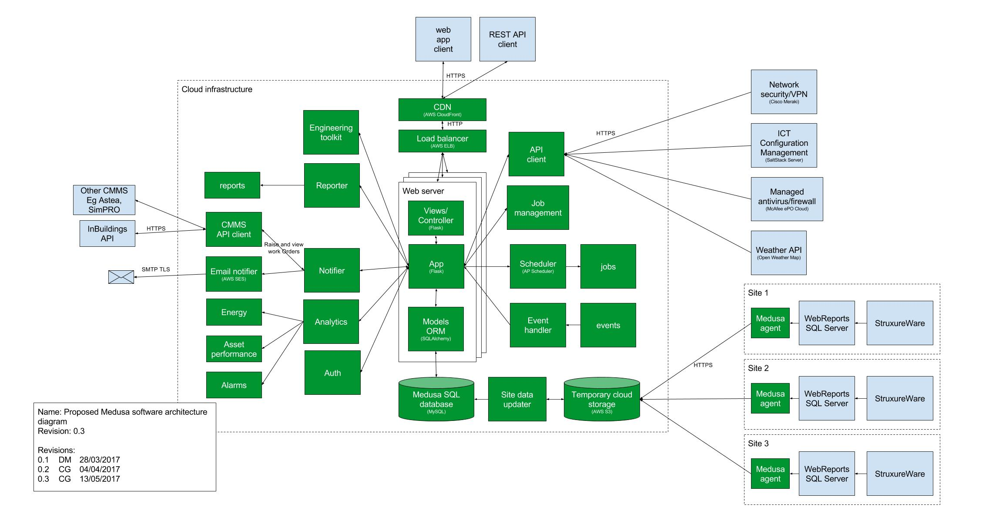

# Medusa architecture

## Technology
The Medusa application stack currently has the following characteristics:
- runs on [AWS EC2](https://aws.amazon.com/ec2/) instance (Ubuntu server)
- is served on an [nginx](https://nginx.org/en/) web server
- reverse proxied to nginx using [uwsgi](https://uwsgi-docs.readthedocs.io/en/latest/)
- built with [Flask](http://flask.pocoo.org/)
- events are scheduled using [AP Scheduler](https://apscheduler.readthedocs.io/en/latest/)
- runs as a service using [systemd](https://wiki.debian.org/systemd)
- models data using [SQLALchemy](https://www.sqlalchemy.org/)
- data lives in a [MySQL](https://www.mysql.com/) instance running on [AWS RDS](https://aws.amazon.com/rds/)

## File system:
- Medusa app lives in `/var/www/medusa`
- Configuration files live in `/var/lib/medusa`. Configuration is loaded from an [S3 bucket](https://aws.amazon.com/s3/) when the `Medusa` systemd service
- uwsgi config lives in `/etc/uwsgi`
- nginx config lives in `/etc/nginx/sites-enabled/medusa`

## Routing and networking:
- Multiple Medusa instances can sit behind an AWS ELB load balancer
- CDN is achieved using AWS Cloudfront
- HTTPS is achived using AWS Certificates assigned to the Cloudfront entry point. Traffic between the Cloudfront edge and the load balancer/EC2 instance is HTTP.
